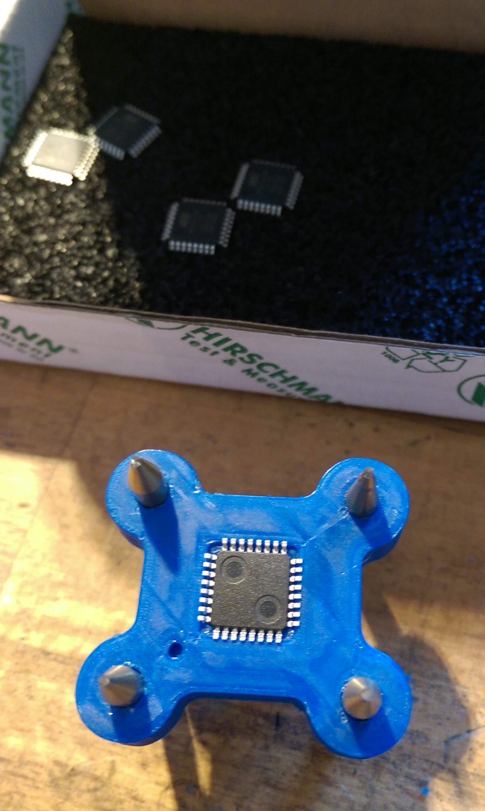

# ATMEGA328 SMD Bootloader Flashing

This is a little project I built to be able to flash my ATMEGA328 SMD chips with an Arduino bootloader.

I allways use the [Optiloader](https://github.com/WestfW/OptiLoader). To flash it to an out-of-factory chip you need to connect the RESET, MISO, MOSI & SCK pins. Additionally a crystal and +5V are required. I designed this simple shield for an Uno with the mentioned connections.

The used components are just a 10k pullup resistor for the RESET pin, a 16MHz crystal with two 22pF capacitors and a few pin headers.

I milled the PCB on my desktop CNC with a 60° V-bit. The resulting PCB looks like this:

To press the chip onto the PCB the 3D printed chip holder is used.

The chip perfectly fits in the recess. At first the recess was slightly to large. I could have reprinted the older with a smalle recess but roughing the inner walls of the recess with a knive solved the problem for me. Now the chip kind of klicks in.

Four bolts guarantee the alignment of chip and PCB. I use broken drill/mill bits from my CNC. Magnets in the holder and on the backside of the PCB apply slight pressure to ensure a reliable contact.

When the chip is in place the bootloader is flashed.

Here is the flashed chip ready to be used in the next project!
